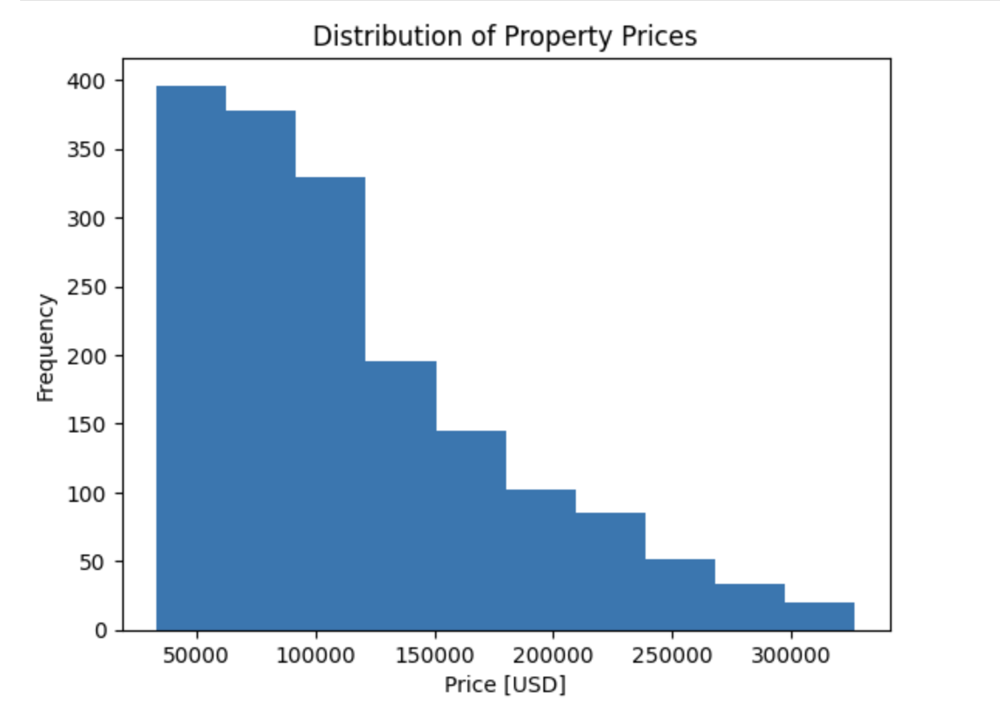
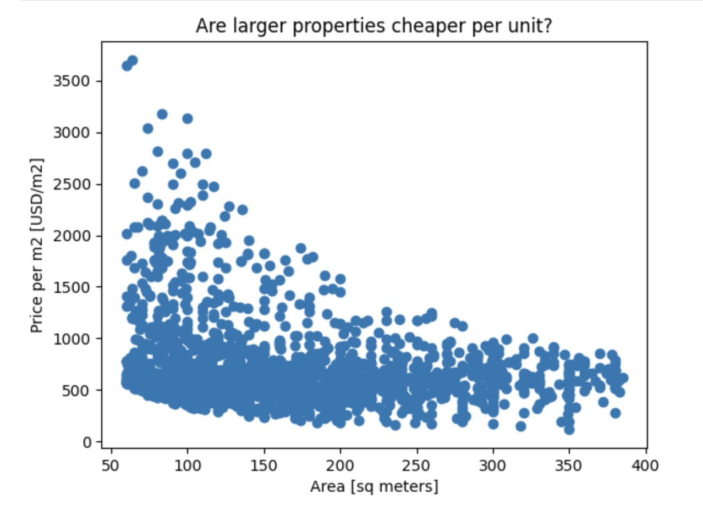
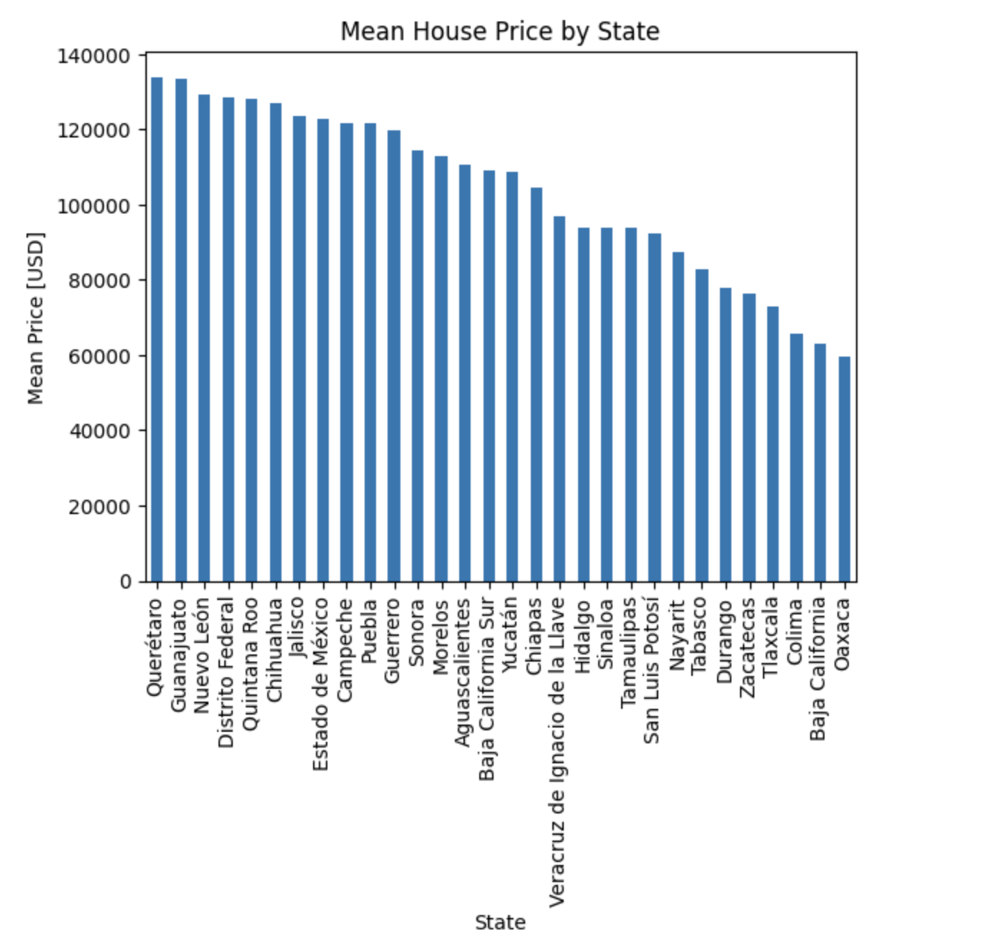
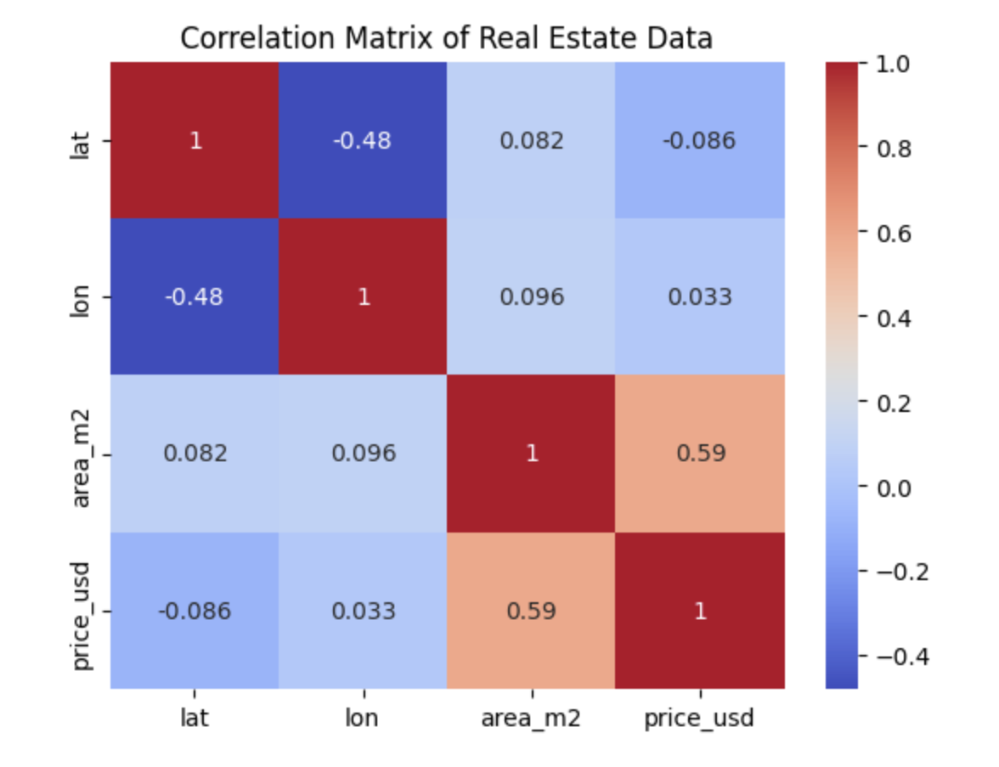

# housing-price-analysis

# Project Overview
This project explores the relationship between housing prices and property characteristics using Python. The analysis investigates how variables such as property size and geographic location influence home prices and demonstrates how statistical techniques can be used to support data-driven decision making.

This project was completed as part of my Applied Data Science studies at WorldQuant University and has been expanded into a professional portfolio project.

# Business Problem
Property prices are influenced by many factors, including property size and location.

The objective of this project is to determine:

- Does a larger home always sell for a higher price?
- How much does location influence housing prices?
- Which variables have the strongest relationship with price?
- Can statistical analysis help explain housing market trends?
  
# Dataset
The dataset contains residential housing information including:

- Property size (square meters)
- Sale price (USD)
- Geographic coordinates
- State
- Other housing characteristics

Each observation represents one residential property.

# Tools
- Python
- pandas
- NumPy
- matplotlib
- Jupyter Notebook
- Git
- GitHub
  
# Project Structure
housing-price-analysis/

├── notebooks/

├── data/

├── images/

├── README.md

├── requirements.txt

└── LICENSE

# Visualization
- Distribution of housing price
  
  Most homes fall within a moderate price range, while a smaller number of luxury homes create a right-skewed distribution.

- Relationship Between House Size and Price
  
  The scatter plot shows a positive relationship between property size and selling price, indicating that larger homes generally command higher prices.

- Top States by Mean Housing Price
  
  Comparing states highlights geographic differences in housing markets and helps identify regions with consistently higher property values.

- Correlation Heatmap
  
  The heatmap summarizes relationships among numerical variables and identifies which features are most strongly associated with housing prices.

# Next Steps
- Perform exploratory data analysis
- Compute correlation matrices
- Build regression models
- Investigate Simpson's Paradox
- Summarize findings
- Develop business recommendations
